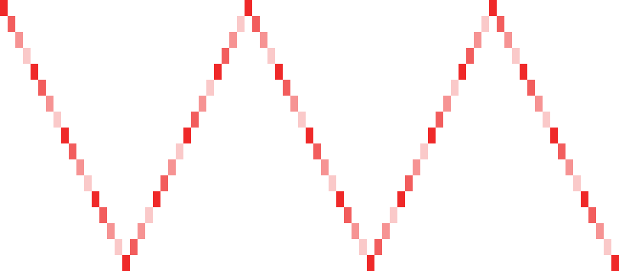

# Basics

## Grid
Computer screens are made of a sequence of squares called pixels just like the squares you see in those old fellow retro games or the blocks in Minecraft.

Computer graphics are magnificent: From squares to circles and curves... Everything in computer graphics is made of these tiny little friends.

Arendelle is also part of the team with a huge difference. Arendelle is made of pixels with dynamic size. It means you can change the size of these pixels. By default the size of Arendelle pixels are bigger than a normal pixel.

In Arendelle we call these squares 'dots' and the screen 'grid'.

<br><br>
## The most basic commands
In Arendelle there is something like a computer mouse called pointer. Imagine Arendelle grid as a chess board and the pointer will be one of those chessmen. To paint a dot we need to select it and for this job we need to move the pointer over it and paint where the pointer is.

To move the pointer and paint where we are we need 5 commands. In Arendelle each command is one character. The first 5 commands we are going to learn are:
<br><br>

| Command     | What it does          |
| ----------- |-----------------------|
| `r`     	  | Go to the right       |
| `l`         | Go to the left        |
| `d`         | Go down               |
| `u`         | Go up                 |
| `p`         | Paint the current dot |

<br><br><hr>
#### Example 0
To learn them you have to code a bit! Now let’s see some of our codes and their results:

```
prd prd p
```

<center><br>

</center>

<hr>

#### Example 1

```
p rrp rrp rrp
```

<center><br>

</center>

<hr>

#### Example 2

```
p rr p dd p ll p
```

<center><br>

</center>

<hr>

#### Exercise
For developers there are so many exercises one of the very first they should start with is "reading" and "writing" codes. We start with reading codes and don't you worry they will never be hard! Read the following code and draw it on a grid screen:

```
rpr dp dp lp lp
```
**NOTE** : The shape you have created is called [Glider](http://en.wikipedia.org/wiki/Glider_%28Conway%27s_Life%29) from the [Conway's Game Of Life](http://en.wikipedia.org/wiki/Conway%27s_Game_of_Life). The first proved to be awesome cellular automaton which is accepted by most hackers to be their logo.

<hr>

<br><br>
## Colors
Arendelle comes with four colors so you can fill each dot with a different color as you see here:



Our default color is the full opacity one, to move to the next color we use `n` command. And please notice that if you're using the last color (the 4th opacity) by using the `n` command you'll move to the first color (the 1st opacity). So let’s have a look at a few examples:

<hr>

#### Example

```
p rn p rn p rn p rn p
```

<center><br>

</center>

<hr>

#### Exercise
Color the previews examples containing 4 dots.

<hr>
